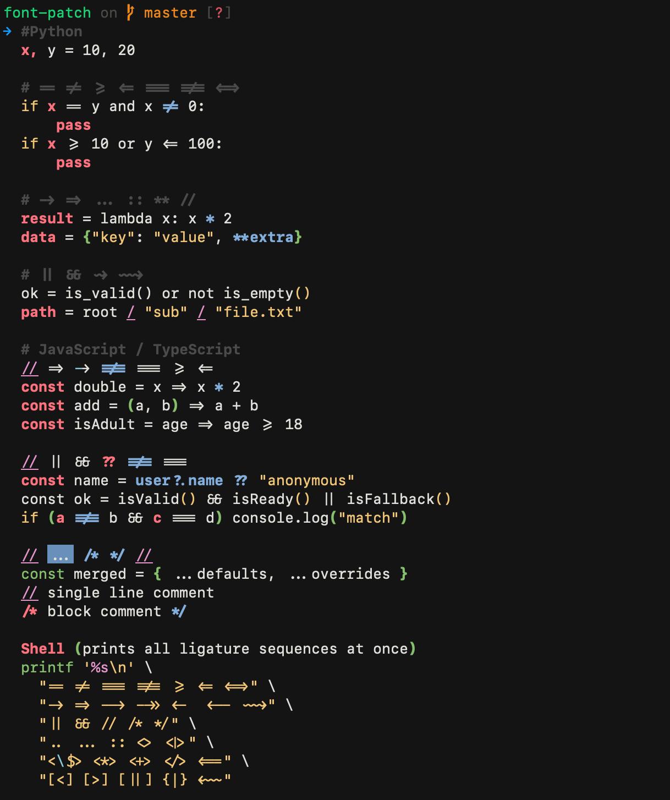

# Apple SF Mono + Nerd Font + Fira Code Ligatures

SF Mono patched with [Nerd Fonts 3.4.0](https://github.com/ryanoasis/nerd-fonts/releases/tag/v3.4.0) glyphs and [Fira Code v6.2](https://github.com/tonsky/FiraCode/releases/tag/6.2) ligatures. All 12 weights and styles.



---

## Install (pre-built)

Either grab the fonts from the **Assets** section of the [latest GitHub release](../../releases/latest), or use the pre-built fonts already in the `fonts/final/` folder. Then copy and clear the cache:

```bash
cp fonts/final/SFMonoNerdFont-*.otf ~/Library/Fonts/
atsutil databases -removeUser
```

Then set your font to **SFMono Nerd Font** in your required terminal or editor:

- **Terminal.app** — Preferences → Profiles → Text → Font
- **VS Code** — `"editor.fontFamily": "SFMono Nerd Font"`, `"editor.fontLigatures": true`

Done

---

## Rebuild from scratch

### 1 — Nerd Font patch

Requires SF Mono OTFs in `fonts/` — either download them from the `fonts/` folder in this repo or extract from Xcode / the SF Mono package.

```bash
brew install fontforge
git clone --depth 1 https://github.com/ryanoasis/nerd-fonts
mkdir -p fonts/nerd-otf

for f in fonts/SF-Mono-*.otf; do
    fontforge -script nerd-fonts/font-patcher "$f" \
        --complete --outputdir fonts/nerd-otf/ --no-progressbars 2>/dev/null
done
```

### 2 — Inject ligatures

```bash
pip3 install fonttools
python3 patch.py
# outputs to fonts/final/
```

### 3 — Install

```bash
cp fonts/final/SFMonoNerdFont-*.otf ~/Library/Fonts/
atsutil databases -removeUser
```

---

## Test ligatures

```bash
./test-ligatures.sh
```

---

## Weights & styles

| Font | Style |
|---|---|
| SFMonoNerdFont-Light | Light |
| SFMonoNerdFont-LightItalic | Light Italic |
| SFMonoNerdFont-Regular | Regular |
| SFMonoNerdFont-Italic | Italic |
| SFMonoNerdFont-Medium | Medium |
| SFMonoNerdFont-MediumItalic | Medium Italic |
| SFMonoNerdFont-SemiBold | SemiBold |
| SFMonoNerdFont-SemiBoldItalic | SemiBold Italic |
| SFMonoNerdFont-Bold | Bold |
| SFMonoNerdFont-BoldItalic | Bold Italic |
| SFMonoNerdFont-Heavy | Heavy |
| SFMonoNerdFont-HeavyItalic | Heavy Italic |

---

## Credits

- **[SF Mono](https://developer.apple.com/fonts/)** — Apple
- **[Fira Code](https://github.com/tonsky/FiraCode)** — Nikita Prokopov
- **[Nerd Fonts](https://github.com/ryanoasis/nerd-fonts)** — Ryan L McIntyre
